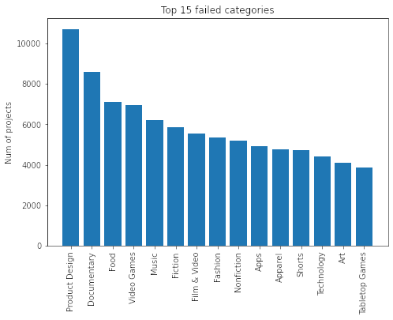
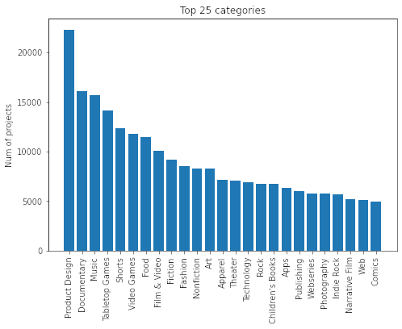

 

  <h1 align="center">Soen 471 - Project</h1>

  <h3 align="center">
    Can we predict if a Kickstarter project would be successful before it launched?
  </h3>

 

  
Table of Contents

  <ol>
    <li>
      <a href="#abstract">Abstract</a>
    </li>
    <li>
      <a href="#introduction">Introduction</a>
      <ul>
        <li><a href="#context">Context</a></li>
        <li><a href="#problem">Problem</a></li>
        <li><a href="#objective">Objective</a></li>
        <li><a href="#related-work">Related Work</a></li>
      </ul>
    </li>
    <li>
      <a href="#materials-and-methods">Materials and Methods</a>
      <ul>
        <li>
          <a href="#dataset">Dataset</a>
          <ul>
            <li><a href="#adjustments-to-the-dataset">Adjustments to the dataset</a></li>
            <li><a href="#dataset-analysis">Dataset Analysis</a></li>
            <li><a href="#data-preprocessing">Data preprocessing</a></li>
          </ul>
        </li>
        <li><a href="#methods">Methods</a></li>
      </ul>
    </li>
    <li>
      <a href="#results">Results</a>
      <ul>
        <li><a href="#analysis">Analysis</a></li>
      </ul>
    </li>
    <li>
      <a href="#discussion">Discussion</a>
      <ul>
        <li><a href="#relevance-of-solutions">Relevance of solutions</a></li>
        <li><a href="#limitations">Limitations</a></li>
        <li><a href="#future-work">Future work</a></li>
      </ul>
    </li>
    <li><a href="#contributors">Contributors</a></li>
  </ol>

# Abstract
 
Starting a company from scratch is no easy feat, entrepreneurs have to build a product, gain clients and backers. This is where many projects fail to see the light, they are missing the funds necessary to expand and establish a grossing business. The website [Kickstarter](https://www.kickstarter.com/) makes this task easier by allowing users to support, give money to, projects that they deem worthy. Unfortunately, not all projects succeed in achieving their fund goal.

Using the [Kickstarter Projects 2018](https://www.kaggle.com/kemical/kickstarter-projects) dataset made by Mickaël Mouillé on Kaggle, we aim to use supervised learning to predict if a project would be successful in reaching its funding goal or fall into the abyss of failed Kickstarter projects.

# Introduction

## Context

In the age of technology, it is as easy as ever to start a project. There is a huge variety of projects that starts every day. Although they may vary, most projects need a fair amount of funding to get started. As such many projects are looking for funds through various websites such as Kickstarter daily.

## Problem

Unfortunately, looking at the statistics available on Kickstarter, we can observe that the vast majority of projects are unsuccessfully funded and end up forgotten. Out of 514,634 launched projects, only 196,396 projects were successfully funded resulting in a success rate of 38.16%. But, projects do not fail necessarily because they are bad. There are multiple examples of projects that failed to get the necessary funds on Kickstarter but still got the necessary funds after a relaunch. There are also many terrible projects that end up not only meeting the funding objectives but also exceeding them by a large margin. For example, in 2016, a potato salad received a total funding of $55,492 asking only $10 to begin with. As such it is hard to predict whether or not a project has everything to maximize the possibility of getting funded successfully.

## Objective

Our objective is to create a prediction system using supervised learning that will predict whether or not a project will likely meet its funding goal. Our goal would be to achieve an accuracy of 95%. Using two distinct supervised learning techniques, we will compare the outcomes of those techniques to study the differences between them and ultimately determine which one is the best.

## Related Work

The idea of analyzing Kickstarter projects to determine if a project will be successful or not is not novel, it has been done by multiple independent researchers on Kaggle. Most of Kaggles’ research uses decision trees to determine if a project will be a success or not. We hope to achieve better results using the techniques learned in class. Additionally, we will use Apache Spark to compute our models and predictions, something that has not been done many times in the past.

# Materials and Methods

## Dataset

The dataset we will use is from Kaggle and was made by Mickaël Mouillé. It is the [Kickstarter Projects 2018](https://www.kaggle.com/kemical/kickstarter-projects). It’s free to use and contains high-quality data (55.34 MB). Although the dataset isn't huge, there are very few missing data and as such, it is of high quality which will ease up the preprocessing phase. A dataset from 2016 was also available, but we found that it was incomplete and missing columns from the 2018 dataset.

The format of the dataset is a CSV file. This dataset contains information about 378 661 projects from 2009 to 2018. There are a total of 15 columns for which we will only use 7: category, main_category, launched, deadline, usd_goal_real, country, state.

Figure 1: First 10 lines of the dataset

### Adjustments to the dataset
 
First, for the label, we would like to predict. Our goal is to predict the state of a Kickstarter project. In particular, we would like to predict if it is successful or not. As such, we will drop every row that is of a state other than “successful” or “failed” since they are not interesting to us.
 
Second, since we are predicting if a project will succeed or not from the start, we will drop the following columns that give information that would only be accessible at the end of a campaign: pledged, backers, usd_pledged, usd_pledged_goal.
 
Third, we will drop the columns that contain duplicate information and opt for the ones that contain the most meaningful information. For example, goal and usd_goal_real are the same except that in one column the goal has been converted to USD. As such we are only keeping usd_goal_real for consistency. The same goes for the currency column.
 
Fourth, the final adjustment we need to make in our dataset is about the DateTime fields. We found that it is hard to predict a date field because dates are cyclical and it can be hard for the computer to understand the distance between dates by only transforming a date into 3 columns (year, month, day). As such we have opted to merge the launched column and deadline column into a single column which is the duration in days where a project is active.
 
The remaining features that we will use are: category, main_category, launched, deadline, usd_goal_real, country, state, as seen in the following figure.

Figure 2: First 10 lines of the dataset after adjustments

### Dataset Analysis
 
Once the data has been cleaned, only 2 states are left, **Successful** and **Failed**, which represents over 331 675 projects.
 
First, we will look at the class frequencies to determine if the dataset needs to be rebalanced in case of class imbalance. Upon analysis, the successful state is present at 40.39% while the failed state is at 59.61%. This is a slight imbalance and not a concern for the experiment we want to conduct so we will not proceed with any class imbalance techniques.

Figure 3: Class frequencies of the dataset

Second, we will look at some general information to give us a general idea of the data that could help us understand some cuts in the decision tree in the results.

Figure 4: Top 15 failed categories

Figure 5: Top 15 successful categories

Figure 6: Top 25 most popular categories

From the last 3 figures, we observe that the category Product Design is the most popular as well as being the most failed and successful category which means that it probably won't be that important because it does not help distinguish between failed and successful. On the other hand, we can look at the category Tabletop Games that is second in successful projects at closely under 8000 and that it is 15th in failed projects at around 4000. This means that the category Tabletop Games has a balance of 2:1 and so it might help distinguish a successful project from a failed one.

### Data preprocessing
 
To feed the data to our models, we will have to preprocess it. This implies several transformation steps and the outcome is a single feature column containing all the features as a vector.
 
The first step consists of string indexing our Categorical data. This will assign an id to all of our categorical data where the smallest id represents the most frequent category. To do this, we are using the StringIndexer function provided by PySpark.
 
Once we have an index for each of our categorical data, we will transform them into one-hot vectors using the function OneHotEncoder provided by PySpark.
 
Finally, using the function VectorAssembler, we will assemble the categorical data as vectors with the numerical data to form a single feature column. In total, we end up with 196 features.

## Methods
 
To analyze and get a prediction from this dataset, we opted to use several tree algorithms and the multilayer perceptron neural network. For the tree algorithms, we will be testing the following: Decision Tree classifier, Random Forest classifier and Gradient Boosted Tree classifier. For the Gradient Boosted Tree classifier, we will also test it with and without cross-validation. 
 
We will use the PySpark framework for our models, and they can be found here [Classification and Regression](https://spark.apache.org/docs/latest/ml-classification-regression.html). We hypothesize that the tree algorithm will perform better than the multilayer perceptron since our features do not interact much with each other. This means that we would not be taking advantage of the deep neural network.
 
Once, we obtain the results using the following algorithms, we will evaluate our predictions. Three metrics will be measured, the area under the receiver operating characteristic curve, the accuracy and finally the F1 score.
 
The area under the ROC represents how well the model can distinguish between our 2 classes which are successful or failed. A value of 1 means that our model can distinguish all the times between the two classes. The same goes for a value of 0 except that the prediction is reversed of what we expected. Finally, a value of 0.5 means that there is no distinction between both classes. We will use the BinaryClassificationEvaluator from PySpark to determine the area under ROC.
 
The accuracy and the F1 score will help us evaluate how accurate our models were. For both, we will use the MulticlassClassificationEvaluator from PySpark.

The full documentation of our evaluator can be found [here](https://spark.apache.org/docs/latest/mllib-evaluation-metrics.html).

# Results
 
For each algorithm, we split the dataset into 70% training and 30% testing.
 
After preprocessing the data and training our different models, here are the results we have obtained with each algorithm.
### Decision Tree 

The decision tree is trained with a depth of 10 and using the Gini impurity.

| Accuracy | F1       | AUROC    |
|----------|----------|----------|
| 0.6615   | 0.6438   | 0.5128   |

Figure 7: Decision Tree confusion matrix

### Random Forest 

The random forest is trained with 20 trees of depth 10 using the Gini impurity.

| Accuracy | F1       | AUROC    |
|----------|----------|----------|
| 0.6485   | 0.6100   | 0.6966   |

Figure 8: Random Forest confusion matrix

### Gradient Boosted Trees

The gradient boosted tree is trained on depth 10 using the Gini impurity with 20 iterations.

| Accuracy | F1       | AUROC    |
|----------|----------|----------|
| 0.6767   | 0.6683   | 0.7285   |

Figure 9: Gradient Boosted Trees confusion matrix

### Gradient Boosted Trees + Cross-validation 

5 fold on a Gradient Boosted tree.

| Accuracy | F1       | AUROC    |
|----------|----------|----------|
| 0.6809   | 0.6713   | 0.7362   |

Figure 10: Gradient Boosted Trees + Cross validation confusion matrix

### Multilayer Perceptron

We kept the default parameters but changed the layers to the following: [192, 32, 32, 32, 2]. The first layer represents the number of features that we have and the final layer is the output (successful or failed).

| Accuracy | F1       | AUROC    |
|----------|----------|----------|
| 0.6051   | 0.5422   | 0.6120   |

Figure 11: Multilayer perceptron confusion matrix

## Analysis

Overall, these results were a bit underwhelming but were within our expectations.
 
All trees were under an accuracy of 70%. Looking at most of the confusion matrices, we see a clear pattern that the trees overpredict that a specific project will fail. Around 50% of the accuracy score comes from the prediction that a project will fail which explains the high number of false negatives in all matrices. The Random Forest algorithm predicts a failed project around 85% of the time which is far from what we would want.
On the other hand, we can observe that the Gradient Boosted trees are the ones that performed the best. They still over-predicted the failed state but had fewer false negatives and more true positives.
 
The multilayer perceptron confusion matrix is very basic, it predicts a failed project 99.5% of the time which is a failure. Even if the accuracy is at 60%, we can say that the model is lacking. 
 
When comparing the trees with the multilayer perceptron, with our current dataset, it is to be expected that the multilayer perceptron performs poorly. Here are our reasons behind the poor performance of the neural network.
 
First of all, our dataset contained features that were not related to each other. For example, changing the category of the project would not have a significant impact on the country. As such, the trees were a lot more suited for our type of dataset.
 
Second of all, the layer configuration. Since we need to configure the layers ourselves, our neural network may not have been set up properly. Unfortunately, there is no best way to do this. Most of the time it comes down to experience. However, we followed some best practices. Since our problem isn’t that complex, we have limited the number of hidden layers (the middle layers) in our model. Also, we kept the size of our hidden layer close to the mean of the input and output layer.
 
Thirdly, since we opted to use the default configurations of the multilayer perceptron, we did not do any hyperparameters tuning. Also, we may have not selected appropriate activation functions and more. All these factors may have hindered how the neural network learned.

# Discussion
 
## Relevance of solutions
 
Finally, by observing our results, it is not hard to realize that our solutions were not ideal to reach our goal which was to accurately predict if a Kickstarter project would succeed or not before it even started. The single decision tree algorithm performed averagely creating a baseline for our other solutions. The Random Forest algorithm performed worse in the predictions’ accuracy, maybe because of the slight imbalance in the classes, but scored better in the area under ROC meaning that the Random Forest has a better ability to distinguish between the two states. The Gradient Boosted Tree algorithm performed the best out of all the algorithms and the Multilayer Perceptron performed the worst because it predicted a failed state for more than 99.5% of the projects. The neural network is completely biased towards that class and would need more work.

## Limitations
 
We realize the techniques we used were greatly limited by our dataset. The best technique achieved an accuracy of 68% while we thought we could achieve at least 95% at the beginning of this project. The data we used is hard to analyze and hard to make predictions on. There are very few features but a high number of categorical values which makes it hard to correlate information from them. We would have liked more features in our dataset like if the project is starred, on the front page of the website and the number of comments and popularity. In the end, what makes a project successful is more than just its duration, goal and category.
 
## Future work
 
It would be interesting to do this experiment again on a larger dataset containing more features. Experimenting with hyperparameters would also be interesting to try to maximize the results. We think Decision Trees are great algorithms for this kind of problem and we would use them again.

# Contributors

| Name                   | Github                                                |
|------------------------|-------------------------------------------------------|
| Phong Le               | [phong1233](https://github.com/phong1233)             |
| Sébastien Blain-Nadeau | [sebastien-blain](https://github.com/sebastien-blain) |